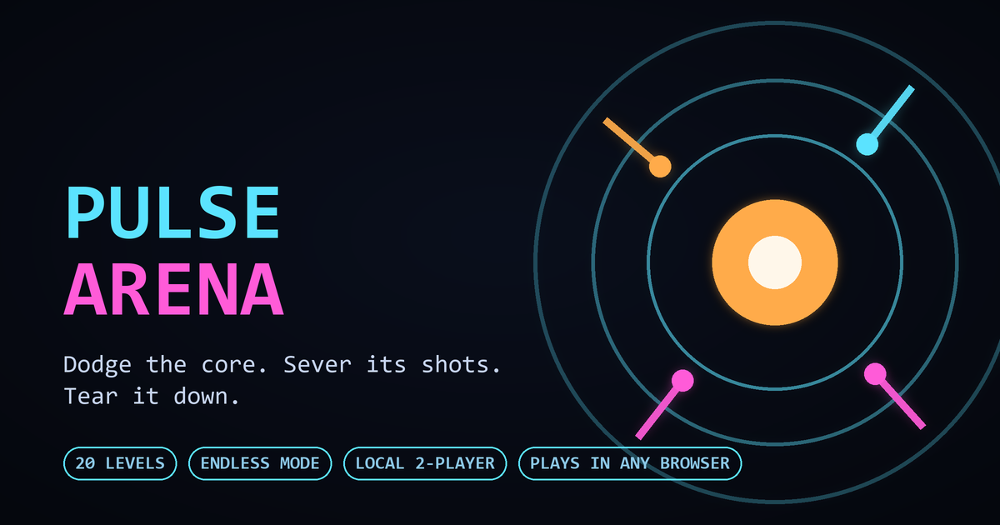

# Pulse Arena

A neon twin-stick survival game that runs in any browser. A pulsing core at the center of a circular arena fires waves of projectiles outward; you weave through them — and fight back.



**[▶ Play it](https://pulse-arena.vercel.app/)**

---

## The idea

Every shot the core fires drags a glowing tail behind it. Cutting through that tail — a **sever** — destroys the shot *and* chips the core's health. So dodging and attacking are the same action performed well: the closer you cut, the faster the core dies.

## Modes

| Mode | Players | Goal |
|---|---|---|
| **Levels** | 1 | Destroy the core across 20 hand-tuned levels. Best clear times earn 1–3 stars. |
| **Endless** | 1 | No core, no win state. Survive a difficulty curve that never stops climbing, for score. |
| **PvP** | 2, one keyboard | *Survival* — last one standing. *Race* — the core splits in two, first to destroy their half wins. |
| **Co-op** | 2, one keyboard | *Survival* — endure together. *Takedown* — one shared, reinforced core. |

Upgrade picks recur throughout every run. Some are passive stat boosts; others unlock a whole new ability. Your build resets at the start of every level or run, so each attempt is a fresh set of choices.

## Controls

**Keyboard**

| Action | Key |
|---|---|
| Move | `WASD` / arrow keys |
| Jump | `Space` |
| Dash | `Shift` |
| Slow-Mo | `E` |
| Wall / Nova / Decoy | `Q` / `F` / `R` *(locked until unlocked by an upgrade)* |
| Pause | `Esc` |

Jump, Dash, Slow-Mo and the three unlockables are all rebindable to any key or mouse button under **Controls**.

**Touch** — phones and tablets get a floating analog stick (drag anywhere on the left half; it appears under your thumb) and tappable ability buttons on the right. The 2-player modes need a physical keyboard.

## Running it

The game is a single self-contained `index.html` with no build step, no dependencies, and no network calls during play. Open the file directly and it works.

To exercise the PWA and offline behaviour you need a real origin — a `file://` page can't register a service worker:

```bash
python -m http.server 8000
# then open http://localhost:8000
```

Two URL flags help while developing:

- `?test=1` — surfaces a **Test Mode** button that unlocks every level and makes you invincible
- `?touch=1` — forces the touch build on a desktop browser

## Deploying

Hosted on Vercel, which deploys straight from `main` — there's no build step or output directory to configure, since the whole site is `index.html` plus the manifest, icons and service worker. Any other static host works the same way.

**Bump `CACHE_VERSION` in [`sw.js`](sw.js) on every release.** The activate handler deletes every cache that doesn't match, so the version bump is what actually retires the old build. Skip it and anyone who has already loaded the game keeps their cached copy — a green deploy they never see.

## Progress and settings

Everything persists to `localStorage` under `pulseArena*` keys — unlocked levels, per-level best times, the Endless high score, keybinds, volume, and the reduce-flashing preference. **Settings → Reset All Progress** wipes the save while deliberately leaving your settings alone.

Storage access is wrapped in try/catch throughout, so the game still runs (without saving) in private-browsing modes that throw on access.

## Accessibility

**Settings → Reduce flashing & shake** dampens the screen flash, screen shake, and RGB-split effects. It defaults to on if your OS reports `prefers-reduced-motion`, and sticks once you set it explicitly either way.

## Project layout

```
index.html              the entire game — markup, styles, and engine
manifest.webmanifest    PWA metadata for install / add-to-home-screen
sw.js                   service worker; network-first, cache as offline fallback
icon*.png, icon.svg     app icons, including a maskable variant
social-card.png         Open Graph / Twitter preview image
```

## Credits

Everything — engine, art, and the procedurally generated soundtrack (24 tracks, synthesised live through the Web Audio API with no audio files) — is original and self-contained.
